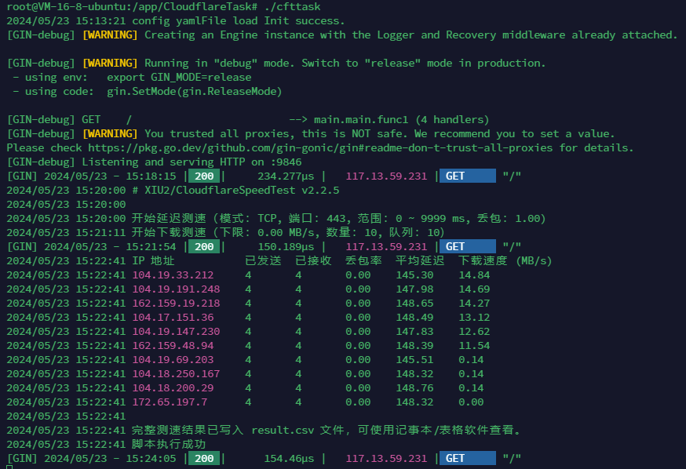

## 自动进行cloudflare优选ip 使用了大佬的脚本[CloudflareSpeedTest](https://github.com/XIU2/CloudflareSpeedTest)
### 小小升级了一下做了个优选域名 自动更新域名解析记录
### 上班摸鱼写的无聊的小项目 懒得总是用电脑自己测 只是为了学习go语言
### windows下打linux可执行包 powershell中依次执行下面的命令
```shell
$env:GOOS = "linux"
$env:GOARCH = "amd64"
go build -o cfttask
```

### 上传可执行文件到服务器 赋予可执行权限
```shell
chmod +x cfttask
```

### 创建系统服务
### 在 /etc/systemd/system/ 目录下创建一个以 .service 结尾的服务文件（例如 cfttask.service
``` shell
[Unit]
Description=cfttask Service
After=network.target

[Service]
User=root
Type=simple
WorkingDirectory=/app/CloudflareTask
ExecStart=/app/CloudflareTask/cfttask
Restart=on-failure
RestartSec=5
StandardOutput=append:/app/CloudflareTask/cfttask.log
StandardError=append:/app/CloudflareTask/cfttask.log

[Install]
WantedBy=multi-user.target
```
### 使用服务
``` shell
sudo systemctl enable cfttask.service  # 启用服务
sudo systemctl start cfttask.service   # 启动服务
sudo systemctl stop cfttask.service   # 停止服务
sudo systemctl status cfttask.service  # 查看服务状态
sudo journalctl -u cfttask.service     # 查看服务日志
```



### 前端页面需要部署在nginx js中的请求地址需要修改为go web服务地址
``` html
<!DOCTYPE html>
<html>
<head>
	<meta charset="UTF-8">
<style>
	body {
		font-family: sans-serif;
	}
	h2 {
		text-align: center;
		margin-bottom: 20px;
	}
	table {
		width: 80%;
		margin: 0 auto;
		border-collapse: collapse;
		box-shadow: 0 0 10px rgba(0, 0, 0, 0.1);
	}
	th, td {
		border: 1px solid #ddd;
		padding: 12px;
		text-align: center;
	}
	th {
		background-color: #f2f2f2;
	}
	tr:nth-child(even) {
		background-color: #f9f9f9;
	}
</style>
</head>
<body>

    <h2>测速结果</h2>

    <table id="resultTable"></table>

    <script>
         fetch('http://127.0.0.1:9846/') // 替换为你的后端服务地址和端口
                     .then(response => response.json())
                     .then(data => {
                         const table = document.getElementById('resultTable');
         
                         // 创建表头
                         const headerRow = table.insertRow();
                         const headers = ["IP 地址", "已发送", "已接收", "丢包率", "平均延迟", "下载速度(MB/s)"];
                         headers.forEach(headerText => {
                             const headerCell = headerRow.insertCell();
                             headerCell.textContent = headerText;
                         });
         
                         // 创建数据行
                         data.forEach(item => {
                             const row = table.insertRow();
                             for (const key in item) {
                                 const cell = row.insertCell();
                                 cell.textContent = item[key];
                             }
                         });
                     })
                     .catch(error => {
                         console.error('Error fetching data:', error);
                     });
    </script>

</body>
</html>
```